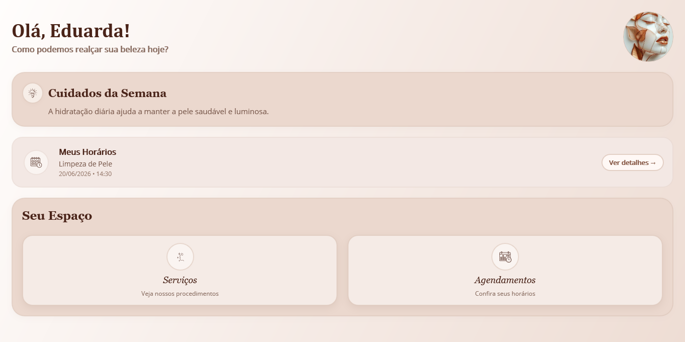
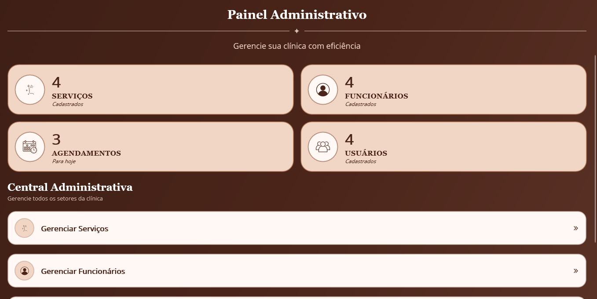

# 💄 Sistema para Clínica Estética

Meu primeiro aplicativo mobile desenvolvido durante o curso Técnico em Informática.

## 📖 Sobre o projeto

Este projeto foi desenvolvido utilizando **C#**, **.NET MAUI** e **XAML**, com o objetivo de criar um sistema para gerenciamento de uma clínica estética.

A aplicação permite o cadastro e o gerenciamento de serviços e agendamentos, utilizando arquivos **JSON** para persistência de dados e consumo de 
uma **API REST**.

## 🎯 Objetivo

Aplicar os conhecimentos adquiridos em desenvolvimento mobile, criando uma aplicação para gerenciamento de uma clínica estética e praticando integração com APIs e persistência de dados.

## ✨ Funcionalidades
- Autenticação com dois perfis de acesso (Usuário e Administrador)
- Cadastro de serviços
- Edição e exclusão de serviços
- Agendamento de atendimentos
- Persistência de dados em arquivos JSON
- Consumo de API REST

## 📷 Preview

### 👤 Modo Usuário

Tela inicial destinada aos clientes, permitindo visualizar os serviços disponíveis e realizar agendamentos.

### 👨‍💼 Modo Administrador

Tela inicial destinada ao administrador, com acesso às funcionalidades de gerenciamento de serviços e agendamentos.

## 🛠️ Tecnologias utilizadas
- C#
- .NET MAUI
- XAML
- JSON
- API REST

## 👩‍💻 Desenvolvido por

**Eduarda Hendges Mendes**
